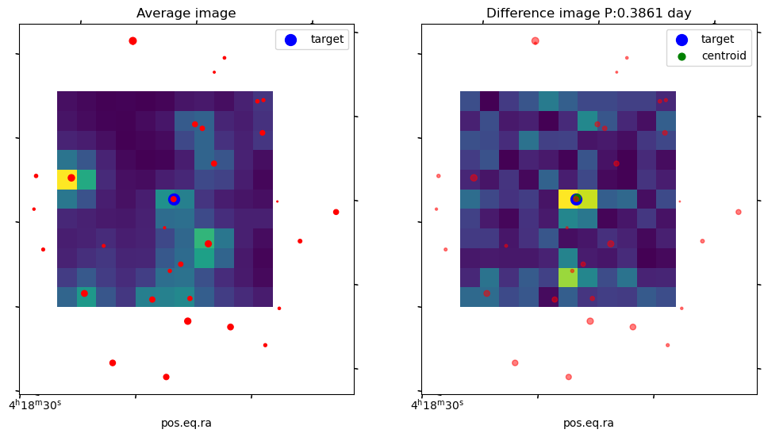

# tesarot
Detecting and confirming stellar rotational periods for TESS data

## Install 
For normal install, 
* python setup.py install
* *For conda/pip env*, go to parental directory of tesarot, and "pip install ./tesarot"

## Install for development
For developers, 

* python setup.py develop
*  *For conda/pip env*, go to parental directory of tesarot, and "pip install -e ./tesarot"

## Test run
Go to ipynb & tests folder

